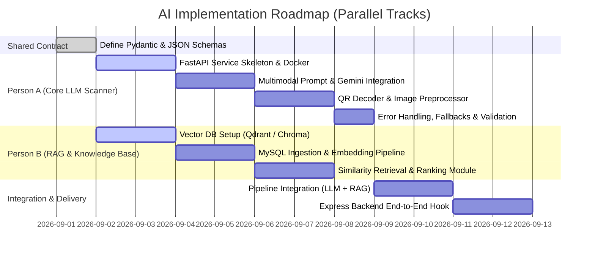

# AI Subsystem Architecture & Engineering Task Division

This document outlines the architecture, data contracts, and parallel 2-engineer work division for the **Banteay Digital** AI intelligence subsystem (Scam Detection, Multimodal Analysis, and RAG Knowledge Retrieval).

---

## 1. System Architecture Overview

The AI subsystem operates as an independent Python microservice (FastAPI) integrated with the Express/Prisma backend. It adheres to the decisions in [Development_Handbook.md](file:///d:/BanteayDigital-Backend/Development_Handbook.md#L1-L495):

1. **Single Multimodal Model Layer:** One primary vision-language LLM (e.g., Gemini 2.5 Flash / GPT 4.1 mini) performs textual analysis, visual inspection, and fraud reasoning in a single pass.
2. **Context-Augmented Intelligence (RAG):** Community-verified scam reports (`ScamReport.status = APPROVED`) are indexed into a vector database to provide grounded scam case context.
3. **Deterministic QR Preprocessing:** QR codes are decoded deterministically (via library) for exact destination inspection before being passed with visual context to the LLM.

```mermaid
flowchart TD
    subgraph Client & Backend
        UI[React Frontend] --> Express[Express Backend / Prisma]
        Express --> DB[(MySQL Database)]
    end

    subgraph AI Service (FastAPI)
        Express -->|POST /api/v1/analyze| Router[API Router & Dispatcher]
        
        Router -->|Extract Payload| QR[QR Decoder Utility]
        Router -->|Query Content| VDB[(Vector Database / RAG)]
        
        VDB -->|Top-K Similar Cases| PromptEngine[Prompt & Context Builder]
        QR -->|Extracted URL / Data| PromptEngine
        Router -->|User Text / Image| PromptEngine
        
        PromptEngine -->|Multimodal Payload| LLM[Multimodal LLM API]
        LLM -->|Raw Completion| Validator[Pydantic JSON Schema Validator]
        Validator -->|Structured Result| Router
    end

    Router -->|Validated Scam Analysis JSON| Express
    Express -->|Save Submission & Status| DB
    Express -->|Real-time Result| UI
```

---

## 2. Shared Data Contracts (Contract-First Design)

To enable true parallel engineering, both engineers work against fixed schema interfaces from Day 1.

### 2.1 Backend <-> AI Service Request Contract

`POST /api/v1/analyze`

```json
{
  "submission_id": "cuid_example_123",
  "content": "Urgent: Your bank account is locked. Click here to verify...",
  "source_url": "https://suspicious-domain.com/login",
  "image_url": "https://storage.banteaydigital.com/uploads/screenshot123.png",
  "input_type": "MULTIMODAL" // "TEXT" | "IMAGE" | "URL" | "QR_CODE" | "MULTIMODAL"
}
```

### 2.2 RAG Module <-> Prompt Builder Contract (Person B output -> Person A input)

```json
{
  "query": "Urgent bank account locked verify login",
  "similar_cases": [
    {
      "id": "case_987",
      "category": "PHISHING",
      "similarity_score": 0.89,
      "summary": "Impersonation of ABA Bank SMS asking victims to verify credentials via fake domain.",
      "indicators": ["Fake domain", "Urgency pressure", "Credential harvesting"]
    },
    {
      "id": "case_654",
      "category": "ACCOUNT_TAKEOVER",
      "similarity_score": 0.82,
      "summary": "Telegram phishing claiming account suspension.",
      "indicators": ["Suspicious login link", "Threat of immediate termination"]
    }
  ]
}
```

### 2.3 AI Service <-> Backend Response Contract

Matches the backend Prisma schema enums (`RiskLevel: LOW | MEDIUM | HIGH | CRITICAL`).

```json
{
  "submission_id": "cuid_example_123",
  "risk_score": 88,
  "risk_level": "HIGH",
  "scam_category": "Phishing & Banking Impersonation",
  "confidence_score": 0.92,
  "analysis_summary": "The message uses urgent psychological pressure and impersonates official banking communication with a deceptive phishing domain.",
  "suspicious_indicators": [
    "Domain mismatch with official bank portal",
    "High urgency coercion ('immediate suspension within 24h')",
    "Requests sensitive credential input through unverified link"
  ],
  "prevention_recommendations": [
    "Do not click the provided link or input banking credentials",
    "Verify directly through the official mobile app or customer helpline",
    "Block and report the sender number/account"
  ],
  "matched_historical_cases": [
    {
      "case_id": "case_987",
      "category": "PHISHING",
      "similarity": 0.89
    }
  ]
}
```

---

## 3. Two-Engineer Work Breakdown Structure (WBS)



### 👤 Person A — Core AI Scanner & LLM Engine

**Ownership:** End-to-end processing of user inputs (Text, Images, URLs, QR codes) through the multimodal LLM into validated structured JSON.

**Key Deliverables:**
1. **AI Microservice Core:** Setup FastAPI application with routing, environment configuration, and structured logging.
2. **Multimodal LLM Integration:** Integrate model client (e.g., Google Gemini 2.5 Flash / GPT 4.1 mini) supporting combined text + vision requests.
3. **Prompt Engineering:** System instructions for scam detection, indicator extraction, category classification, and structured JSON formatting.
4. **QR Code Extraction Utility:** Deterministic QR decoding library (e.g., `pyzbar` / `opencv-python`) to parse payload URLs before LLM submission.
5. **Schema Validation & Resiliency:** Pydantic output validation, retry mechanisms, timeout fallbacks, and token/cost telemetry.
6. **Mock RAG Integration:** Test core pipeline independently using mocked historical cases.

### 👤 Person B — RAG Subsystem & Vector Knowledge Base

**Ownership:** Indexing verified scam reports and retrieving semantically similar historical fraud patterns to enrich analysis prompts.

**Key Deliverables:**
1. **Vector Storage Setup:** Initialize vector store instance (e.g., Qdrant, ChromaDB, or pgvector).
2. **Embedding Model Pipeline:** Select and integrate text embedding model (e.g., `text-embedding-3-small` or `models/text-embedding-004`).
3. **Data Ingestion Pipeline:** Script to pull approved scam reports (`ScamReport.status = APPROVED` and associated `CommunityPost` data) from MySQL and upsert embeddings + metadata.
4. **Retrieval & Ranking Service:** Implement similarity search query engine returning top-k similar cases formatted to the shared RAG schema.
5. **Retrieval Quality Benchmarking:** Test semantic search accuracy against varied scam inquiry phrasing.
6. **Sync Worker / Hook:** Periodic or webhook-triggered ingestion for new approved scam submissions.

### 🤝 Shared Responsibilities
- Contract validation and schema freeze before coding.
- Merging RAG context retriever into the main analysis pipeline.
- End-to-end integration with Express backend (`POST /api/submissions` -> AI Service -> MySQL update).
- Evaluation on test dataset (calculating false positives vs. false negatives).

---

## 4. Responsibility & Ownership Matrix

| Area / Component | Primary Owner | Secondary / Reviewer | Deliverable / Output |
| :--- | :--- | :--- | :--- |
| **API Contracts & JSON Schemas** | Person A | Person B | Pydantic Request/Response models |
| **FastAPI Service Infrastructure** | Person A | Person B | `ai-service/app/` runtime & Dockerfile |
| **Multimodal LLM Client** | Person A | Person B | Gemini/OpenAI vision integration |
| **Scam Detection Prompts** | Person A | Person B | System prompts & few-shot examples |
| **Deterministic QR Decoder** | Person A | Person B | Image QR parser utility |
| **Vector DB Deployment** | Person B | Person A | Qdrant / Chroma instance |
| **Scam Report Ingestion Script** | Person B | Person A | MySQL -> Vector DB sync pipeline |
| **Similarity Search Service** | Person B | Person A | `retrieve_similar_cases(query)` |
| **LLM + RAG Context Stitching** | Person A | Person B | Combined prompt execution |
| **Express Backend AI Hook** | Person A | Person B | Express service HTTP client / webhook |
| **Benchmark Test Suite** | Person B | Person A | False-positive / false-negative test set |

---

## 5. Recommended Python AI Service Structure

```text
ai-service/
├── app/
│   ├── __init__.py
│   ├── main.py                  # FastAPI entry point
│   ├── config.py                # Environment & model settings
│   │
│   ├── api/
│   │   ├── __init__.py
│   │   ├── routes.py            # /analyze, /health, /ingest endpoints
│   │   └── dependencies.py      # Auth & service injection
│   │
│   ├── schemas/
│   │   ├── request.py           # Pydantic input schemas
│   │   ├── response.py          # Pydantic output schemas (RiskLevel, etc.)
│   │   └── rag.py               # RAG context schemas
│   │
│   ├── services/
│   │   ├── scanner_service.py   # Person A: Orchestrates input -> LLM -> JSON
│   │   ├── llm_client.py        # Person A: Gemini/OpenAI multimodal client
│   │   ├── rag_service.py       # Person B: Embedding & similarity retrieval
│   │   ├── vector_store.py      # Person B: Vector DB adapter (Qdrant/Chroma)
│   │   └── qr_decoder.py        # Person A: Deterministic QR extractor
│   │
│   ├── prompts/
│   │   ├── scam_detection.py    # Base system instructions
│   │   └── few_shots.py         # Exemplar scam cases
│   │
│   └── utils/
│       ├── image_loader.py      # Image download/base64 utility
│       └── logger.py            # Structured logging
│
├── tests/
│   ├── test_scanner.py          # Unit tests for scanner (with mock RAG)
│   ├── test_rag.py              # Unit tests for vector search
│   └── test_integration.py      # End-to-end analysis tests
│
├── data/
│   └── benchmark_cases.json     # Curated scam test dataset
│
├── .env.example
├── Dockerfile
└── requirements.txt
```

---

## 6. Execution Strategy: Independent Parallel Tracks

To avoid blocking one engineer on the other, follow this phased execution plan:

```text
Track A (Person A):
[Mock Input] -> [FastAPI Router] -> [Gemini Multimodal] -> [Mock RAG Injection] -> [Validated JSON]
                                                                        ▲
                                                                        │ (Replaced at Phase 3)
Track B (Person B):                                                     │
[Approved MySQL Reports] -> [Embedding Model] -> [Vector DB] -> [Similarity Query API]
```

### Phase 1: Contract Freeze (Day 1)
- Align on Pydantic models in `schemas/`.
- Ensure enums match Prisma (`RiskLevel: LOW | MEDIUM | HIGH | CRITICAL`, `AnalysisStatus`).

### Phase 2: Independent Prototyping (Days 2–4)
- **Person A:** Implement `scanner_service.py` using hardcoded mock RAG context. Verify multimodal image + text processing end-to-end.
- **Person B:** Implement `vector_store.py` and `rag_service.py`. Seed database with sample scam reports and verify retrieval quality via CLI/test suite.

### Phase 3: Integration (Days 5–6)
- Replace mock context in `scanner_service.py` with calls to `rag_service.py`.
- Run combined multimodal + RAG scam scans.

### Phase 4: Express Backend Connection (Day 7)
- Connect Express `submission.service.js` to dispatch analysis tasks to the Python AI service.
- Update `ScamSubmission` record with `analysisStatus = COMPLETED`, `riskLevel`, `riskScore`, and `analysisSummary`.

---

## 7. Immediate Day 1 Action Items

1. **Both Engineers (30 mins):**
   - Confirm model provider key (e.g., Google AI Studio Gemini API key).
   - Review and approve `schemas/request.py` and `schemas/response.py`.

2. **Person A Kickoff:**
   - Initialize `ai-service/` with FastAPI.
   - Implement minimal working route: `POST /api/v1/analyze` accepting text/image URL and returning structured Pydantic response from Gemini.

3. **Person B Kickoff:**
   - Initialize vector database instance (e.g., local Qdrant container or ChromaDB).
   - Write ingestion script to embed sample scam records and execute similarity search for test queries.